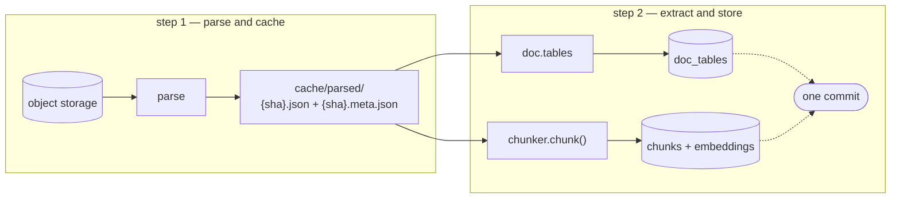

# rag-embeddings

Parses documents once, caches the parse, and fans the result out to two sinks:
tables into relational columns, everything else into chunk embeddings. Both
writes land in a single transaction.



The two steps run as separate processes. Step 1 needs Docling and a disk; step 2
needs a GPU-ish machine and the database. Neither needs what the other has.

Work is published, not invoked. `enqueue` puts one message per document on
`to-parse`; the **dispatcher** claims each message and starts one container to
parse it, then the container exits. Nothing is up waiting for work — an idle
backlog costs one small process, not N parse pods.

```
enqueue -> to-parse -> dispatcher -> parse container (per document, then gone)
                                          |
                                          v
                                      to-index -> index worker -> postgres
```

---

## Layout

```
serve.py                     entrypoint: the search API (FastAPI)
rag_embeddings/
  config.py                  env -> Settings, the only place os.environ is read
  profiles.py                EmbedProfile + the named profiles
  embedder.py                tokenizer, chunker and model, from one profile
  blobstore.py               where the cache lives: local now, object store later
  cache.py                   parse cache and the manifest sidecar
  cli.py                     flags shared by the producer, the workers, the dispatcher
  shutdown.py                SIGTERM -> finish the document in flight, then stop
  extraction/
    tables.py                branch A: tables -> relational rows
    chunks.py                branch B: chunks -> vectors
  storage/
    connection.py            connect() + register_vector
    sql.py                   every statement, in one place
    writer.py                write_all(): both branches, one commit
  steps/
    parse.py                 what a source string means, for the producer
    search.py                the read side: embed a query, rank chunks
  api/
    app.py                   the service: model and pool, built once at startup
    routes.py                POST /search
    schemas.py               the wire contract
  queues/
    base.py                  the Queue interface + consume/retry/dead-letter
    memory.py                backend: in-process, for tests
    files.py                 backend: a directory, for containers on a volume
    messages.py              ParseRequest and IndexRequest
  runners/
    base.py                  the Runner interface + wait/timeout/cancel
    local.py                 backends: the local Docker daemon, a subprocess
    ecs.py                   backend: an ECS task
    kube.py                  backend: a Kubernetes Job
    memory.py                backend: records launches, starts nothing
  workers/
    enqueue.py               the producer, and the whole-cache coordinator jobs
    dispatcher.py            step 1: one container per document
    lambda_dispatch.py       the same loop, as an SQS-triggered Lambda
    parse_worker.py          what a dispatched container runs: one document, then exit
    index_worker.py          step 2, one document per message
  pipeline.py                ingest / reextract / rechunk, for in-process use
sql/schema.sql               the DDL
tests/test_wiring.py         producer + both steps, no torch, no database
tests/test_queues.py         the queue contract, run against every backend
tests/test_dispatch.py       the dispatcher, and what each runner would start
```

---

## Run it

```bash
uv sync --extra cpu                     # or --extra cu126 on a GPU host
docker build -t parse-worker:latest .   # the image the dispatcher starts
```

Initialize the API, db and index service:

```bash
docker compose up -d
```

Then the pipeline itself — publish the work, dispatch it, index it:

```bash
# one message per document, named by its path on this machine
uv run python -m rag_embeddings.workers.enqueue --queue-url "file://$PWD/queue" \
  files "$PWD/inbox"

# step 1: one container per document, four at a time, against the local daemon
```bash
rag-dispatcher --queue-url "file://$PWD/queue" --cache-dir "$PWD/cache/parsed" \
  --runner-url "docker://?volume=$PWD/cache:$PWD/cache&volume=$PWD/queue:$PWD/queue" \
  --image parse-worker:latest --max-in-flight 4
```

The queue is `./queue` — a directory, no broker to install — and the parse cache
is `./cache/parsed`. Both are passed to the parse containers at the paths they
already have, which is what the two `volume=` entries in the runner url are for.

To see what the dispatcher would start without starting anything:

```bash
rag-dispatcher --dry-run --idle-timeout 0
```
---

## Configuration

Every knob is a CLI flag with an environment-variable default, resolved once in
`config.py`. Flags beat the environment; the environment beats the defaults.

| Env var | Flag | Default |
|---|---|---|
| `RAG_CACHE_DIR` | `--cache-dir` | `cache/parsed` |
| `RAG_PARSER_VERSION` | `--parser-version` | `docling-2.118` |
| `RAG_DSN` (or `DATABASE_URL`) | `--dsn` | `postgresql://localhost/docs` |
| `RAG_EMBED_PROFILE` | `--profile` | `bge-m3` |
| `RAG_EMBED_MAX_TOKENS` | `--max-tokens` | from the profile |
| `RAG_EMBED_HEADROOM` | `--headroom` | `128` |
| `RAG_EMBED_TOKEN_BUDGET` | `--embed-token-budget` | `16384` |
| `RAG_QUEUE_URL` | `--queue-url` | `file://./queue` |
| `RAG_PARSE_QUEUE` | `--parse-queue` | `to-parse` |
| `RAG_INDEX_QUEUE` | `--index-queue` | `to-index` |
| `RAG_IDLE_TIMEOUT` | `--idle-timeout` | unset — never exit |

The dispatcher adds a set of its own, read into a separate `DispatchSettings`
for the reason the API's are separate: none of it reaches the pipeline. A
document parses to the same bytes whether Docker or Fargate started the
container, and whether four ran at once or forty.

| Env var | Flag | Default |
|---|---|---|
| `RAG_RUNNER_URL` | `--runner-url` | `docker://` |
| `RAG_PARSER_IMAGE` | `--image` | `parse-worker:latest` |
| `RAG_TASK_COMMAND` | `--task-command` | unset — the image's entrypoint |
| `RAG_TASK_ENV` | `--task-env` | unset |
| `RAG_TASK_CPU` | `--task-cpu` | unset — the backend's default |
| `RAG_TASK_MEMORY_MB` | `--task-memory` | unset |
| `RAG_MAX_IN_FLIGHT` | `--max-in-flight` | `4` |
| `RAG_DISPATCH_BATCH` | `--batch-size` | `10` |
| `RAG_ACK_ON` | `--ack-on` | `exit` (`launch` in Lambda) |
| `RAG_TASK_TIMEOUT` | `--task-timeout` | `900` |


## Step 1 — parse and cache

`enqueue` decides which files exist and puts one message on `to-parse` per
document:

```bash
python -m rag_embeddings.workers.enqueue files inbox/                      # a directory
python -m rag_embeddings.workers.enqueue files inbox/ --pattern '*.pdf'    # filtered
python -m rag_embeddings.workers.enqueue files a.pdf b.pdf 'reports/*.docx'
python -m rag_embeddings.workers.enqueue files inbox/ --force              # after a Docling upgrade
```

### The dispatcher

`rag-dispatcher` reads `to-parse` and, instead of parsing, starts one container
per document:

```
to-parse -> dispatcher -> parser container   (docker | ECS | Kubernetes)
```

### The seams

Nothing above them names a backend, so moving to a cluster is configuration:

| Seam | Today | In a cluster |
|---|---|---|
| `RAG_QUEUE_URL` | `file://./queue` — a directory | `sqs://`, `amqp://`, Redis |
| `RAG_CACHE_DIR` | a local directory | `s3://bucket/prefix` |
| `RAG_RUNNER_URL` | `docker://` — the local daemon | `ecs://cluster/task-def`, `k8s://namespace` |

| `RAG_RUNNER_URL` | what it starts |
|---|---|
| `docker://?volume=…&network=…` | a container on the local daemon |
| `process://` | a child process — no image, for working on the parser |
| `ecs://<cluster>/<task-def>?subnets=…` | an ECS task (Fargate by default) |
| `k8s://<namespace>?service_account=…` | a Kubernetes Job, `backoffLimit: 0` |
| `memory://` | nothing; records what it would have started |

The url is the only place a backend is named and everything after `?` is
placement, so a new backend is a `Runner` subclass with two methods plus one
branch in `open_runner()`. Waiting, timing out and killing an overrunning task
are written once in `runners/base.py` and inherited.

The queue works the same way: a `Queue` subclass with six transport methods and
one branch in `open_queue()`. Everything above transport — the receive loop,
acking, returning failures, counting attempts, dead-lettering — is written once
in `queues/base.py`, and `tests/test_queues.py` runs the same contract against
every backend so a new one either passes or is not done.

A new blob backend is a `BlobStore` with five primitives and two context
managers. The interface yields *paths* rather than bytes because Docling's
`save_as_json` / `load_from_json` want a real file; locally that path is the
cache file itself and nothing is copied, while a remote backend stages a temp
file and transfers around the yield.

---

## Step 2 — extract and store

The index worker consumes `to-index`, loads the cached parse, runs both
branches, and writes them in one transaction per document. No parser runs here.

### Chunk size without changing models

`--max-tokens` overrides the named profile's sizing in place, so it needs no
`--profile` alongside it:

```bash
RAG_EMBED_MAX_TOKENS=1024 python -m rag_embeddings.workers.index_worker
```

BGE-M3 accepts 8192 tokens, which is a ceiling rather than a recommendation —
one embedding has to represent everything inside it, and a chunk that spans four
topics retrieves worse than four chunks that each span one. 1024 (minus the
default 128 of headroom, so 896 for the splitter) is the usual starting point
when hits come back topically right but too coarse to quote from.

The model is unchanged, so the vectors stay comparable in dimension — but not in
content, because the text that produced them is different. That makes it a
reprocessing trigger, not a query-time knob: it belongs in the `--chunks-only`
row of the table above, and every document indexed at the old size is now stale.
`profile.version` embeds the number (`BAAI/bge-m3@1024-128`), so `stale` sees
the change on its own:

```bash
RAG_EMBED_MAX_TOKENS=1024 python -m rag_embeddings.workers.index_worker &
python -m rag_embeddings.workers.enqueue stale
```

Set it once and leave it. Half a corpus at 8192 and half at 1024 ranks
incoherently — long chunks accumulate loosely-related text that matches many
queries weakly, and they compete against short chunks that match one query
strongly. `RAG_EMBED_MAX_TOKENS` in the environment is the way to keep it
consistent across hosts and invocations.

---

## Querying

That snippet is `steps/search.py`, with the profile check added, served over
HTTP by `serve.py` — one query in, ranked chunks out:

```bash
curl -s localhost:8000/search -H 'content-type: application/json' \
     -d '{"query": "what were the Q3 logistics costs?"}'
curl -s localhost:8000/search -H 'content-type: application/json' \
     -d '{"query": "patrimônio líquido em junho", "limit": 10}'
curl -s localhost:8000/search -H 'content-type: application/json' \
     -d '{"query": "logistics costs", "window": 1}'     # neighbours too
```

## Database setup

`sql/schema.sql` holds the DDL; the `db` service applies it on first start of an
empty data directory. Against any other server, apply it by hand:

```bash
psql postgresql://localhost/docs -f sql/schema.sql
```

`vector(1024)` matches BGE-M3. Change it if you change models — and note that
altering the dimension requires dropping and rebuilding the column.

# ToDo
[ ] Add log progress to index worker. It currently does the work silently
[ ] Create terraform infrastructure
[ ] Provision infrastructure
[ ] Move everything to cloud
[ ] Test project with cloud infra
[ ] Improve Parse and index Speed